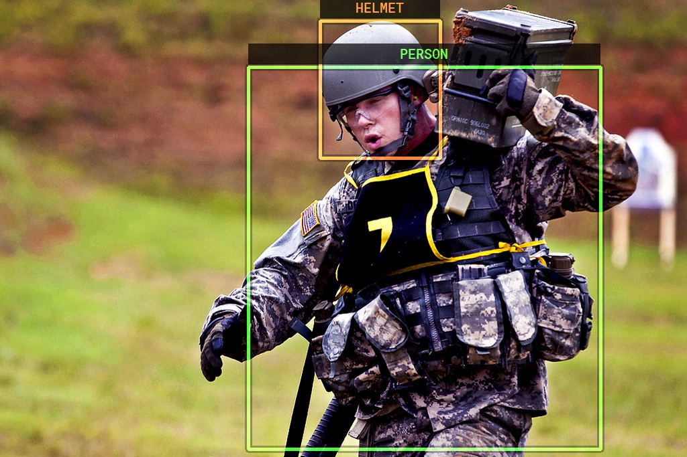
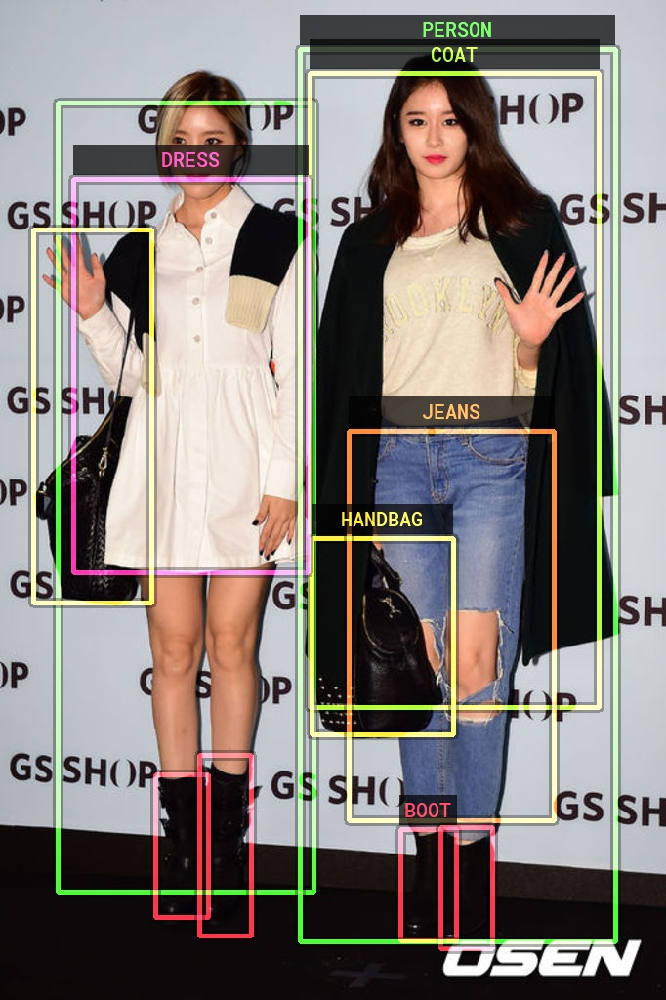
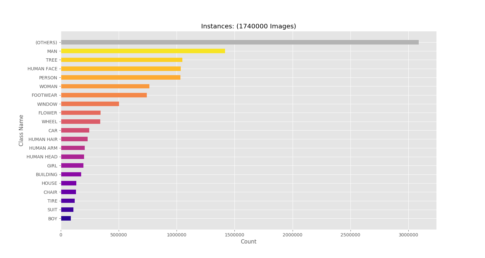
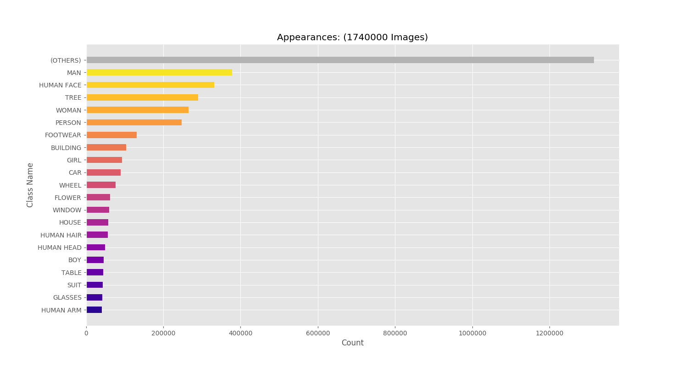

# Open Image Challenge 2018 Starter Kit


## Introduction

This is a starter kit (just a bunch of scripts and tools) for the [Open Image 2018 Challenge](https://storage.googleapis.com/openimages/web/challenge.html) hosted by Kaggle and Google. The motivation for this:

* My computer and connection are weak as piss and I need a better way to load the data than in 50 GB chunks.
* I would like to deepen my understanding of detection and classification models, so I want to create some tools that will help me explore and experiment with the data in chunks that are managable.

The code in this repository will load the ground truth data, and wrap them up in some custom classes I have created to make exploration and experimation a bit easier. More detail about this in the section below.


## Quick Start Guide

Open terminal and activate your Python environment (it needs to be Python 3.6) and navigate to this directory.

Install the requirements:

```bash
pip install -r requirements.txt
```

Next you need to create a 'settings.yaml' file and put in the paths for your data and output directories. I've made an example file, so you can just copy that. The actual settings file will be ignored by git.

```bash
cp settings-example.yaml settings.yaml
```

This is what the settings look like:

```yaml
LABELS_FILE: "./challenge-2018-class-descriptions-500.csv"
GROUND_TRUTH_FILE: "./challenge-2018-train-annotations-bbox.csv"
IMAGE_URL_FILE: "./train-images-boxable.csv"

OUTPUT_DIRECTORY: "./output"
SAMPLES_DIRECTORY: "./samples"
STORAGE_DIRECTORY: "./storage"
```

So you'll need to download those files from [here](https://storage.googleapis.com/openimages/web/challenge.html) (somewhere) and make sure the path in the settings match up.

Now we are ready to start. In the first step we will create **Samples**. A sample is basically the meta-data of one image, all its annotations, and a remote path to the image all in one place. The idea is that it will be easier to work with this data from a development perspective. But because we will have so many samples, the script will split them up into batches of 5000 samples per **set**. Hopefully this will make it easier to work with. Each set will be saved as a .json file.

```bash
# Create Samples from the ground truth data files.
python cmd_create_samples.py 
```

Once the samples are created you can pick a set of them (each set should contain 5000 samples) and begin downloading the images just for that set. If your connection is crap like mine, then this is a lot easier than attempting to swallow a whole 50GB of images at once.

```bash
# Load all the images for the sample set at index 0.
# Replace this number with the set you want to work with.
python cmd_load_sample_images.py -i 0
```

PS: If you stop the download prematurely, then be careful of some incomplete JPEG files.

Once the downloads are finished (or you don't even need to finish them all) you can visualize the annotations on these images.

```bash
# Visualize 50 images from set 0.
python cmd_visualize_samples.py -i 0 -n 50
```


## Visualized Images






## Class Analysis

Here is a breakdown of the number of instances of each class in the entire training data set.



Here is a graph showing the number of images containing at least one instance of the respective class.



## Data Types

As I have mentioned above, I've wrapped the data from the ground truth into some custom types.

### Sample

Each image is wrapped up in a sample.

```python
# Sample Class constructor.
def __init__(self):
	self.key: str = ""  # Unique ID for this image.
	self.set_index: int = None
	self.remote_path: str = ""
	self.detect_regions: List[DetectRegion] = []
	self._local_path = None
```

The sample has a key (same as the image name) and a list of all the annotated bounding box regions.

It also has a couple of convienience properties, like a function to load its image from the local file as a CV2 image, or download the image from the remote path if it hasn't been stored yet.

```python
# Get the image of the sample with the bounding boxes drawn on.
image = sample.get_visualized_image()
```

### DetectRegion

Each bounding box is wrapped up in a DetectRegion. It has pretty much the same boolean attributes as the ground truth boxes. The difference here is that the co-ordinates is expressed as a region, which has the `left, right, top, bottom, x, y, width and height` properties. The region enforces these properties so that if any is modified, the other values will be updated as well to maintain the relationship of all these values.

The co-ordinates are not pixel based values, but a relative factor of the image's size.

When samples are exported into JSON form, it looks something like this:

```json
"key": "e39871fd9fd74f55",
"remote_path": "https://requestor-proxy.../e39871fd9fd74f55.jpg",
"detect_regions": [
    {
          "left": 0.389323,
          "right": 0.661458,
          "top": 0.094727,
          "bottom": 0.571289,
          "class_id": "/m/01g317",
          "confidence": 1.0,
          "is_occluded": 1,
          "is_truncated": 0,
          "is_group_of": 0,
          "is_depiction": 1,
          "is_inside": 0
    }
]
```